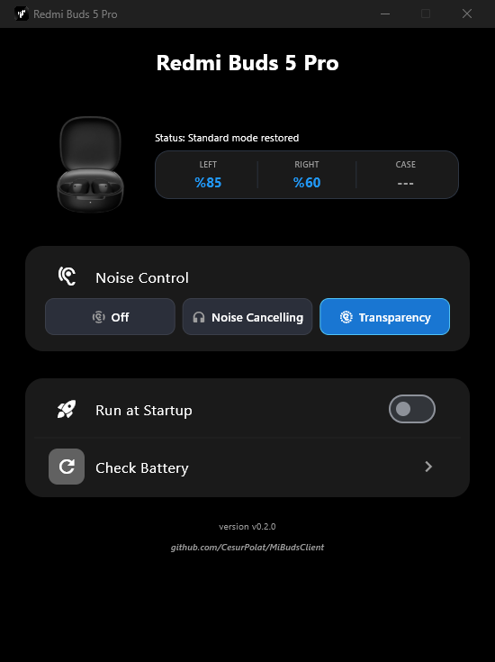

# MiBudsClient

**See your Xiaomi / Redmi Buds battery and control them from your PC.** Battery of each earbud and the case, noise control and low-latency (gaming) mode for Redmi/Xiaomi Buds on Windows and Linux. No phone, no account, no cloud: the app talks to the earbuds directly over Bluetooth.

[](LICENSE)


[Leer en español](README.es.md)

<p align="center">
  
</p>

## Why

Xiaomi only ships a phone app for its earbuds. On a PC you could pair them but never see how much battery was left, switch noise cancelling, or turn on the low-latency mode that removes the audio delay in games. MiBudsClient fills that gap, using the same protocol the official app uses.

## Features

- **Battery** of the left earbud, the right earbud and the charging case, with a charging indicator and a sound when an earbud starts or stops charging.
- **Noise control** (Redmi Buds 5 Pro): off, noise cancelling or transparency. The card follows the earbuds: if you change the mode by touching them, the app updates.
- **Low-latency mode** (Redmi Buds 6 Play): Off, On, or **Auto**, which turns it on by itself when a game goes fullscreen, with per-app include/exclude lists.
- **System tray**, **run at startup**, **single instance**, **update notifications** and automatic reconnection.
- **Works with several models** with one app: it detects which earbuds are connected and shows only what that model supports.

## Supported earbuds

| Model | Battery | Noise control | Low-latency | Status |
|-------|:-------:|:-------------:|:-----------:|--------|
| Redmi Buds 5 Pro | left / right / case | yes | not yet | Verified on real hardware |
| Redmi Buds 6 Play | left / right / case | n/a | yes | Verified on real hardware |
| Any other Redmi / Xiaomi Buds | combined level reported by the OS | not yet | not yet | **Not verified**, help wanted |

For a model that is not verified yet, the app still detects it, shows its name and a combined battery level (the same number Windows shows), and records the packets it exchanges so the model can get a proper profile. See [Help us support your model](#help-us-support-your-model).

> **Tested on Windows 11.** The original project supports Linux; the new models have not been tried on Linux yet. Reports are welcome.

## Quick start

1. Pair your earbuds in the Bluetooth settings of your system and **connect** them (take them out of the case).
2. Install [Python](https://www.python.org/downloads/) 3.10 or newer, then:

   ```bash
   git clone https://github.com/LeandroPG19/Buds.git
   cd Buds
   python -m venv .venv
   ```

   Activate the environment (`.venv\Scripts\activate` on Windows, `source .venv/bin/activate` on Linux) and run:

   ```bash
   pip install -r requirements.txt
   python main.py
   ```

The first launch downloads the Flet desktop client, which can take a few minutes. After that it starts in seconds.

**If the app says it cannot find your earbuds:** make sure they are connected (not only paired), that they are out of the case, and that no other program is holding their control connection.

## How it works

```
Bluetooth device list  ->  model profile  ->  RFCOMM channel  ->  session  ->  UI
   (by device name)       (profiles.py)      (OS SDP cache)    (battery, noise control)
```

1. **Detect** which connected Bluetooth device is a Redmi/Xiaomi Buds, by name.
2. **Pick its profile** (`bluetooth/profiles.py`): how to talk to that model and what it supports.
3. **Find the control channel.** It differs per model, so the app reads it from the service records the OS already stored when you paired.
4. **Open the session.** Newer earbuds, like the 5 Pro, only answer after an authentication handshake; the 6 Play answers directly.
5. **Show** what the earbuds report and send what you click.

The protocol, including the handshake, is documented in [docs/PROTOCOL.md](docs/PROTOCOL.md).

## Help us support your model

There are many Redmi/Xiaomi Buds models and I only have a few. If yours is not verified, you can get it supported in a few minutes:

1. Connect your earbuds and run the app. A notice says the model is not verified and where the capture is saved: `%APPDATA%\MiBudsClient\packets-<model>.log`.
2. Use the app for a minute (press **Check Battery**, change what you can).
3. [Open an issue with the "Add my model" form](../../issues/new?template=add-my-model.yml) and attach the log.

The log only contains the bytes exchanged with the earbuds. It can include your earbuds' Bluetooth address; delete those lines if you prefer. How to turn a capture into a profile is explained in [AGENTS.md](AGENTS.md) and [docs/PROTOCOL.md](docs/PROTOCOL.md).

## Download

Ready-to-run builds for **Windows** and **Linux** are published on the [Releases page](../../releases): unzip and run, no Python needed. The Windows file is not code-signed, so SmartScreen may warn you; choose *More info* → *Run anyway*.

**macOS is not supported.** The app talks to the earbuds through a Bluetooth RFCOMM socket, and Python does not offer one on macOS, so a Mac build would open but could never reach the earbuds. Supporting it means writing a separate backend on Apple's `IOBluetooth` framework, and it needs a Mac to be tested.

## Build it yourself

```bash
pip install -r requirements-build.txt
python scripts/build.py
```

It runs the tests, builds the program for the system you are on (Windows or Linux) and leaves a zip in `dist/`. The release workflow (`.github/workflows/release.yml`) runs the same script on GitHub.

## Development

```bash
pip install -r requirements-dev.txt
python -m pytest
```

The test suite covers the protocol, the cipher (with challenge/answer pairs captured from real earbuds), discovery, reconnection and preferences. A change to the bytes of a profile still has to be tried on that model's hardware; see [AGENTS.md](AGENTS.md) for the project rules.

```
main.py              application and UI wiring
bluetooth/           profiles, discovery, connection, controller, protocol and session
ui/                  Flet components, tray and window handling
utils/               preferences, updater, game monitor, packet capture
tests/               pytest suite
docs/                protocol documentation
```

## Credits

This project is a fork of [CesurPolat/MiBudsClient](https://github.com/CesurPolat/MiBudsClient), which created the app and the Redmi Buds 6 Play support. The authentication handshake of newer earbuds follows the protocol documented by [Gadgetbridge](https://codeberg.org/Freeyourgadget/Gadgetbridge) and [XiaomayEarbudsWin](https://github.com/Apechi/XiaomayEarbudsWin); the Python implementation here is independent and validated on real hardware.

## License

[GNU General Public License v3.0](LICENSE). This is free software: you can use, study, modify and share it, as long as derived work stays free too.

---
*This is not an official Xiaomi application. It is developed for personal use and the open-source community. "Xiaomi" and "Redmi" are trademarks of their owners.*
